# Multi-Agent 模组说明书

本文档说明当前续写系统中各 Agent 的职责、输入输出、调用顺序，以及如何复用同一套 API 完成不同任务。

## 1. 总体目标

系统将一次续写任务拆分为三个职责明确的 Agent：

1. `CharacterAgent`：角色对白生成（多角色多轮）
2. `NarratorAgent`：对白整理为小说叙事
3. `ReflectionAgent`：对成文进行编辑评估并给出改进建议

三者共用同一个 `LLMClient`（同一 provider/model/base_url/api_key），只在提示词和任务目标上区分职责。

## 2. 模块关系图

```mermaid
flowchart TD
    main[main.py] --> llmClient[LLMClient]
    main --> charAgents[CharacterAgent x N]
    main --> orchestrator[Orchestrator]
    main --> narratorAgent[NarratorAgent]
    main --> reflectionAgent[ReflectionAgent]

    orchestrator --> dialog[(dialog list)]
    charAgents --> orchestrator
    llmClient --> charAgents
    llmClient --> narratorAgent
    llmClient --> reflectionAgent

    dialog --> narratorAgent
    narratorAgent --> storyText[(story text)]
    storyText --> reflectionAgent
    reflectionAgent --> reviewText[(review text)]
    reviewText --> output[outputs/*.md]
```

## 3. 关键文件与职责

- `src/main.py`
  - 负责启动流程、选择模型参数、装配各 Agent、输出结果文件。
- `src/llm.py`
  - 统一 API 客户端与 provider/key 选择逻辑。
- `src/agent.py`
  - `CharacterAgent`，按人物配置和关系生成对白。
- `src/narrator.py`
  - `NarratorAgent`，把对白转成连贯叙事文本。
- `src/reflection.py`
  - `ReflectionAgent`，对成文做质量评估并输出建议。
- `prompts/character_template.txt`
  - 角色 Agent 的基础系统提示词模板。
- `prompts/narrator_prompt.txt`
  - 叙事 Agent 的系统提示词模板。
- `prompts/reflection_prompt.txt`
  - 编辑 Agent 的系统提示词模板。

## 4. 一次执行的完整流程

### Step A: 选择与构建 LLM 客户端

`main.py` 会先确定 provider/model/base_url/key_index，然后调用：

- `build_client(base_dir, llm_config, provider, model, base_url, key_index, debug)`

得到一个共享的 `LLMClient` 实例。

### Step B: 角色对话阶段（CharacterAgent）

`Orchestrator.run()` 逐轮调用角色 Agent：

1. 按回合选择说话者
2. 生成对白（LLM 优先，失败时模板回退）
3. 把对白事件写入所有角色短期记忆

输出：`dialog`（结构化对白列表）

### Step C: 叙事成文阶段（NarratorAgent）

`NarratorAgent.compose(world, dialog)`：

1. 读取 `prompts/narrator_prompt.txt` 作为 system prompt
2. 输入场景和对白记录
3. 生成 1-2 段小说化文本
4. 若 LLM 不可用或失败，回退到 `narrate()` 的模板拼接方案

输出：`story_text`

### Step D: 编辑评估阶段（ReflectionAgent）

`ReflectionAgent.review(world, dialog, story_text)`：

1. 读取 `prompts/reflection_prompt.txt` 作为 system prompt
2. 输入对白与成文
3. 输出简短评价 + 改进建议
4. 失败时返回空字符串（不阻断主流程）

输出：`review_text`

### Step E: 写出最终文件

最终输出内容：

1. run_id
2. story 正文
3. （可选）编辑评注

写入 `outputs/scene_01_story_<run_id>.md`。

## 5. Prompt 驱动机制

### Character Prompt

模板变量：

- `{character_name}`
- `{persona}`
- `{speaking_style}`
- `{goals}`
- `{taboo}`
- `{relationships}`
- `{scene}`

`CharacterAgent` 会把角色配置与场景上下文填入，形成每个角色稳定的人设约束。

### Narrator Prompt

用于控制叙事风格、节奏、起承转合，而不是简单拼接对白。

### Reflection Prompt

用于定义“好文本”的标准（人物一致性、关系延续、古典气质、具体性等），并转化为可执行改进建议。

## 6. 默认 OpenAI 行为

当前设计下，未显式传入 `--provider` 且非交互模式时会默认使用 `openai`。
交互模式下 provider 选择会默认指向 `openai`（若配置中存在）。

如果 OpenAI key/model/base_url 缺失，角色对白会回退模板；叙事/评估也会走对应回退路径。

## 7. 可扩展方向

1. 增加 `PlannerAgent`：每轮先给出剧情推进目标，再让角色发言。
2. 增加 `JudgeAgent`：对白轮次结束后打分，触发自动重写。
3. 把 `ReflectionAgent` 建议回灌下一轮上下文，形成自迭代闭环。
4. 支持多场景串联：上一场 `review` 作为下一场先验约束。

